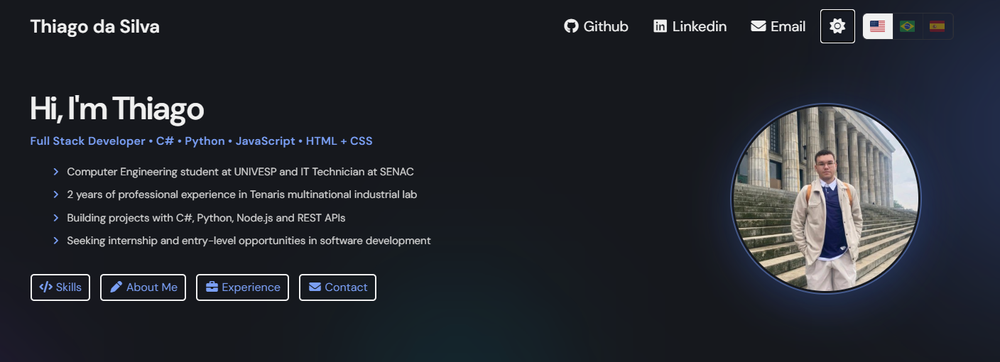

# Thiago da Silva — Developer Portfolio

A modern, responsive, and accessible developer portfolio built from scratch, designed to showcase real-world projects, technical skills, and continuous professional growth.

**Live:** [dasilva-thiago.dev](https://www.dasilva-thiago.dev)

---

## Motivation

This portfolio was designed to solve a real problem: presenting my technical skills, projects, and contact information in a clear, professional, and accessible way.
I built everything from scratch to strengthen my understanding of frontend architecture, backend integration, and user experience design.

---

## UI Overview

### Desktop

<p align="center">
  
  <br>
  <em>Desktop layout with optimized spacing, component alignment, and Bootstrap grid.</em>
</p>

<br>

### Mobile

<p align="center">
  
  <br>
  <em>Mobile-first implementation with custom breakpoints (600px, 740px, 850px).</em>
</p>

---

## Features

- **Dark mode** — toggles with a single click, persists via `localStorage`
- **Multilingual (i18n)** — English, Portuguese, and Spanish with dynamic JSON loading and browser language auto-detection
- **Responsive design** — mobile-first layout with custom breakpoints at 600px, 740px, and 850px
- **Project carousel** — Bootstrap-powered with keyboard and touch support
- **Contact form** — connected to Web3Forms with client-side validation, email regex check, and localized user feedback
- **Scroll animations** — AOS for section reveals and GSAP for the hero entrance cascade
- **Aurora background** — animated radial gradient orbs with GPU-accelerated motion, respects `prefers-reduced-motion`

---

## Tech Stack

### Frontend

| Technology | Purpose |
|---|---|
| HTML5 / CSS3 | Structure and styling |
| JavaScript (vanilla, ES modules) | Dark mode, i18n, form submission, animations |
| Bootstrap 5 | Carousel, responsive grid |
| Font Awesome 7 | Icons |
| GSAP 3 | Hero entrance animation |
| AOS 2 | Scroll-triggered section animations |
| Web3Forms | Contact form email delivery |
| Vite 8 | Build tool and local dev server |

---

## Project Structure

```
dev-portfolio/
├── index.html
├── vite.config.js
├── package.json
├── css/
│   ├── styles.css            # Root import — assembles all partials
│   ├── base/
│   │   ├── aurora.css        # Animated background orbs
│   │   ├── reset.css         # Global reset and base typography
│   │   └── variables.css     # CSS custom properties (light + dark theme)
│   ├── layout/
│   │   ├── footer.css
│   │   └── navbar.css
│   └── sections/
│       ├── about.css
│       ├── contact.css
│       ├── experience.css
│       ├── hero.css
│       ├── projects.css
│       └── skills.css
├── js/
│   ├── main.js              # Entry point — imports CSS and all JS modules
│   ├── animations.js        # GSAP hero entrance + AOS init + footer year
│   ├── contact.js           # Form validation and Web3Forms submission
│   ├── darkMode.js          # Dark mode toggle and localStorage persistence
│   └── i18n.js              # Language switching with dynamic JSON loading
├── public/
│   └── locales/
│       ├── pt.json          # Portuguese translations
│       └── es.json          # Spanish translations
├── assets/
│   ├── img/                 # Profile photos, project screenshots
│   └── icons/               # Favicon

---

## Contact Form — How It Works

The contact form uses [Web3Forms](https://web3forms.com), a serverless email delivery service with a public access key. No backend is required.

Client-side flow:

1. Input validation — checks for empty fields and valid email format
2. Submits JSON to `https://api.web3forms.com/submit`
3. Displays localized feedback to the user — success or error, in the active language

Localized feedback messages are defined in `locales/pt.json` and `locales/es.json` under `contact.feedback`, and fall back to English defaults if a translation is missing.

---

## i18n — How Translations Work

Language priority on load: `localStorage` → browser language → English (default).

- English text lives directly in the HTML as `data-i18n-default` values — no JSON fetch needed
- Portuguese and Spanish are loaded dynamically from `public/locales/` and cached in memory
- Switching language updates the page instantly with no reload
- All UI elements use `data-i18n` keys for targeting, including form placeholders and hero bullet points

---

## Projects Featured

| Project | Stack | Description |
|---|---|---|
| [Buenos Aires Explorer](https://github.com/dasilva-thiago/BuenosAiresExp) | C#, .NET, SQLite, Windows Forms | Desktop app for organizing points of interest with route planning and coordinate lookup |
| [Developer Portfolio](https://github.com/dasilva-thiago/dev-portfolio) | HTML, CSS, JS, Bootstrap, Vite | This website |
| [Aviation Safety Project](https://github.com/dasilva-thiago/aviation_safety_project) | Python, Power BI, Pandas, NumPy, OpenPyXL | Data visualization simulating an aeronautical control room |
| Industrial Safety Localization | Technical writing, process improvement | Led end-to-end translation and standardization of machine safety labels at Tenaris |

---

## About Me

I am a Computer Engineering student focused on backend development, databases, and building real-world applications.

After working in an industrial laboratory environment, I transitioned into tech to pursue a career aligned with problem-solving, software engineering, and continuous learning.

I am currently seeking internship opportunities where I can contribute, learn fast, and grow as a developer.

---

## Contact

- **Website:** [dasilva-thiago.dev](https://www.dasilva-thiago.dev)
- **LinkedIn:** [linkedin.com/in/thiago-da-silva-876805269](https://www.linkedin.com/in/thiago-da-silva-876805269/)
- **GitHub:** [github.com/dasilva-thiago](https://github.com/dasilva-thiago)
- **Email:** thiagosilva785@gmail.com

---

<p align="center">Made by Thiago da Silva • Pindamonhangaba, SP, Brazil</p>