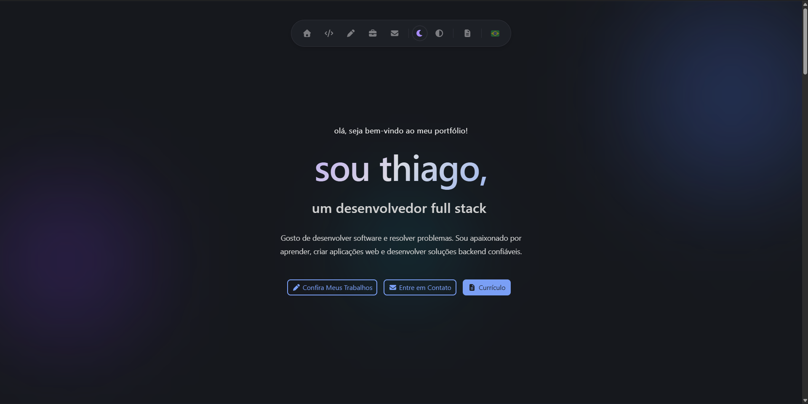
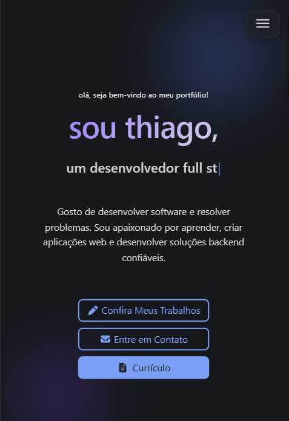

# Thiago da Silva — Developer Portfolio

A modern, responsive, and accessible developer portfolio built from scratch with vanilla JavaScript, showcasing real-world projects, technical skills, and professional experience.

**Live:** [dasilva-thiago.dev](https://www.dasilva-thiago.dev)

---

## Motivation

This portfolio was built to solve a concrete problem: presenting technical skills, projects, and contact information in a clear, professional, and accessible way to recruiters and collaborators.

The project has gone through several iterations — starting as a Bootstrap-based static site and evolving into a custom design system with modular CSS, GSAP-driven animations, and a fully custom i18n implementation. Every architectural decision was made to strengthen my understanding of frontend structure, accessibility, and build tooling, without relying on frontend frameworks.

---

## UI Overview

### Desktop

<p align="center">
  
</p>

### Mobile

<p align="center">
  
</p>

---

## Features

- **Custom design system** — aurora animated background, glassmorphism surfaces, CSS custom properties throughout, no utility-class framework
- **Dark mode & high contrast mode** — both toggle independently, persist via `localStorage`, and use a synchronous inline script in `<head>` to prevent FOUC before first paint
- **Multilingual (i18n)** — English, Portuguese, and Spanish, built with a custom system (no external library). English lives directly in the HTML via `data-i18n-default` as the source of truth; Portuguese and Spanish are lazy-loaded from JSON only on explicit language selection and cached in memory
- **Responsive navigation** — desktop pill navbar that hides on scroll past the hero section and reveals via a hover trigger zone (`IntersectionObserver`-based); a separate right-sliding drawer with overlay/blur for mobile, built independently rather than as a breakpoint variant of the desktop nav
- **Unified About + Experience section** — split-screen layout (identity/bio on the left, education/experience cards on the right), with expandable modal cards for detailed entries (e.g. internship, past role) using `data-modal` + `aria-expanded`
- **Skills section** — a consolidated icon grid for core technologies and an animated "runway" progress-bar group for technologies currently being learned, with GSAP-driven fill animation triggered on scroll
- **Project showcase** — a static, curated grid (featured, secondary, and compact cards), replacing the earlier carousel-based layout
- **Contact form** — Web3Forms integration with client-side validation, honeypot spam protection, a live character counter, and localized success/error feedback
- **Scroll animations** — GSAP + ScrollTrigger for entrance and reveal animations, AOS for lightweight section fade-ins; the two are kept on separate elements to avoid conflicts
- **Aurora background** — animated radial-gradient orbs with GPU-accelerated motion and parallax on scroll, respects `prefers-reduced-motion`
- **SEO & structured data** — JSON-LD (`ProfilePage`, `Person`, `WebSite`), `sitemap.xml` with an automated `lastmod` update script, and `robots.txt`
- **Security** — strict Content-Security-Policy defined in `index.html`
- **Analytics** — Google Analytics via `gtag.js`
- **Testing** — Vitest unit tests covering the i18n module

---

## Tech Stack

| Technology | Purpose |
|---|---|
| HTML5 / CSS3 | Structure and styling |
| JavaScript (vanilla, ES modules) | All application logic — no frontend framework |
| Vite 8 | Build tool and local dev server |
| GSAP 3 + ScrollTrigger | Hero entrance, scroll-triggered reveals, skills bar animation |
| AOS 2 | Lightweight scroll fade-ins on select sections |
| Font Awesome (`@fortawesome/fontawesome-svg-core`) | Icons, tree-shaken as an npm subset rather than the full CDN package |
| Fontsource (DM Sans, DM Mono) | Self-hosted typography, no Google Fonts CDN dependency |
| flag-icons (CDN) | Flag icons for the language switcher |
| Web3Forms | Contact form email delivery |
| Vitest | Unit testing |

---

## Project Structure

```
dev-portfolio/
├── index.html
├── vite.config.js
├── package.json
├── robots.txt
├── sitemap.xml
├── scripts/
│   └── update-sitemap.js     # Updates sitemap lastmod on build
├── css/
│   ├── styles.css            # Root import — assembles all partials
│   ├── base/
│   │   ├── fonts.css         # Fontsource imports
│   │   ├── variables.css     # CSS custom properties (light, dark, high-contrast)
│   │   ├── reset.css         # Global reset and base typography
│   │   └── aurora.css        # Animated background orbs
│   ├── layout/
│   │   ├── navbar.css        # Desktop pill navbar + hide/reveal behavior
│   │   ├── footer.css
│   │   └── mobile-nav.css    # Mobile hamburger drawer
│   └── sections/
│       ├── hero.css
│       ├── about.css         # About + Experience (unified)
│       ├── skills.css        # Icon grid + runway progress bars
│       ├── projects.css
│       └── contact.css
├── js/
│   ├── main.js                # Entry point — imports CSS and all JS modules
│   ├── core/
│   │   ├── icons.js           # Font Awesome subset registration
│   │   ├── darkMode.js
│   │   ├── contrastMode.js
│   │   └── i18n.js
│   ├── ui/
│   │   ├── animations.js      # GSAP + ScrollTrigger + AOS init
│   │   ├── contact.js         # Form validation and Web3Forms submission
│   │   ├── cv.js               # CV download links per language
│   │   ├── langDropdown.js
│   │   ├── typewriter.js
│   │   ├── mobileNav.js
│   │   ├── about.js            # Expandable modal cards
│   │   └── navbarScroll.js     # Hide-on-scroll trigger
│   └── __tests__/
│       └── i18n.test.js
├── public/
│   └── locales/
│       ├── pt.json
│       └── es.json
└── assets/
    ├── img/
    └── icons/
```

---

## Contact Form — How It Works

The contact form is powered by [Web3Forms](https://web3forms.com), a serverless email delivery service with a public access key — no backend required.

**Client-side flow:**

1. Honeypot field check to silently discard spam bot submissions
2. Input validation — empty fields and email format
3. Submits JSON to `https://api.web3forms.com/submit`
4. Displays localized feedback — success or error, in the active language, with a live character counter for the message field

Localized feedback messages are defined in `locales/pt.json` and `locales/es.json` under `contact.feedback`, and fall back to English defaults if a translation is missing.

---

## i18n — How Translations Work

Language priority on load: `localStorage` → browser language → English (default).

- English text lives directly in the HTML as `data-i18n-default` values — no JSON fetch needed
- Portuguese and Spanish are fetched from `public/locales/` only when explicitly selected, and cached in memory for the rest of the session
- Switching language updates the page instantly with no reload, including form placeholders and `aria-label` attributes
- All translatable elements use `data-i18n` (or `data-i18n-aria`) keys for targeting

---

## Projects Featured

| Project | Stack | Description |
|---|---|---|
| [Buenos Aires Explorer](https://github.com/dasilva-thiago/BuenosAiresExp) | C#, .NET, SQLite, Windows Forms | Desktop app for organizing points of interest with geocoding API integration, distance calculation, and route planning |
| [Developer Portfolio](https://github.com/dasilva-thiago/dev-portfolio) | HTML, CSS, JS, Vite | This website — custom i18n system, FOUC-safe dark mode, modular CSS architecture |
| [Aviation Safety Project](https://github.com/dasilva-thiago/aviation_safety_project) | Python, Pandas, NumPy, OpenPyXL, Power BI | Data pipeline with layered architecture: generation → transformation → export → visualization |
| [Travel Explorer](https://github.com/dasilva-thiago/TravelExplorer) | HTML, CSS, JavaScript, TypeScript, React | In development — an evolution of Buenos Aires Explorer with a global scope, optimized routing, and business integration |
| [Educator Portfolio](https://github.com/dasilva-thiago/evelyn-website) | HTML, CSS, JavaScript | Handcrafted portfolio for a professional educator, featuring a fully interactive 3D Rubik's Cube built with pure CSS `perspective` and `transform-style: preserve-3d` |
| Industrial Safety Localization | Root cause analysis, technical documentation | Identified a multilingual documentation gap at Tenaris and led the full corrective process end-to-end |

---

## Running Locally

```bash
npm install
npm run dev
```

Build for production:

```bash
npm run build
```

Run tests:

```bash
npm test
```

---

## Contact

- **Website:** [dasilva-thiago.dev](https://www.dasilva-thiago.dev)
- **LinkedIn:** [linkedin.com/in/dasilva-thiago](https://www.linkedin.com/in/dasilva-thiago/)
- **GitHub:** [github.com/dasilva-thiago](https://github.com/dasilva-thiago)
- **Email:** thiagosilva785@gmail.com

---

<p align="center">Made by Thiago da Silva • Pindamonhangaba, SP, Brazil</p>